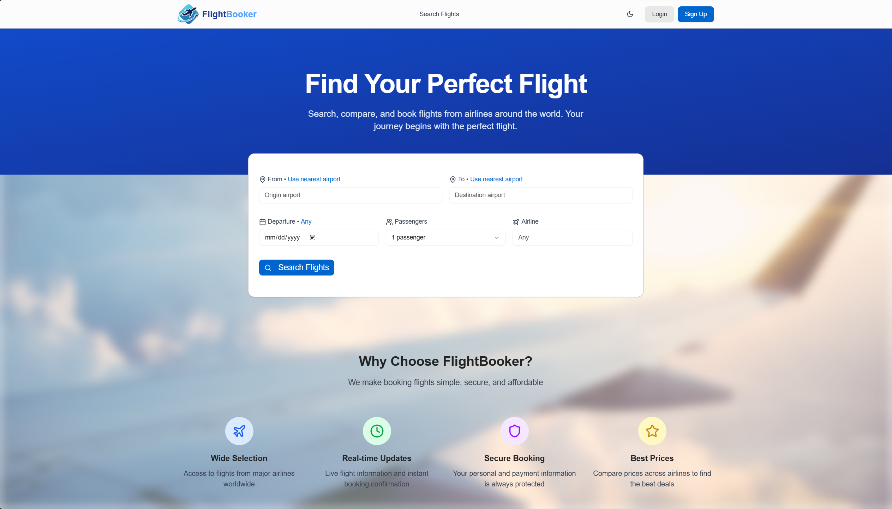

# Flight Planner Frontend 🌍✈️

This is the user interface (UI) application for the **Flight Planner API**, designed and implemented using React, TypeScript, and Vite. It serves as a comprehensive platform for users to search, book, and manage flights, and provides administrative dashboards for airline staff and system administrators.

This project was developed at **Turkcell** as an internship project.

**Backend API:** The backend is deployed at [https://flight-planner-backend-323247003818.us-central1.run.app/](https://flight-planner-backend-323247003818.us-central1.run.app/). Please note that the backend only accepts requests originating from this frontend application's domain to ensure security and proper integration.
**Frontend:** The Flight Planner Frontend is deployed to Google Cloud Run and is publicly accessible at:
[https://flight-planner-frontend-323247003818.us-central1.run.app/](https://flight-planner-frontend-323247003818.us-central1.run.app/)

## Table of Contents

-   [Features](#features)
-   [Technologies Used](#technologies-used)
-   [Running the Project Locally (with Docker)](#running-the-project-locally-with-docker)
-   [Prerequisites (Manual Setup)](#prerequisites-manual-setup)
-   [Getting Started (Manual Setup)](#getting-started-manual-setup)
    -   [Clone the Repository](#1-clone-the-repository)
    -   [Configuration](#2-configuration)
    -   [Install Dependencies](#3-install-dependencies)
    -   [Run the Application](#4-run-the-application)
-   [Deployed Version](#deployed-version)
-   [API Interaction & Documentation](#api-interaction--documentation)
-   [Authentication & Authorization](#authentication--authorization)
    -   [User Roles](#user-roles)
    -   [How to Get Credentials](#how-to-get-credentials)
-   [Key User Flows & UI Components](#key-user-flows--ui-components)
-   [Project Structure](#project-structure)
-   [Testing](#testing)
-   [Contributing](#contributing)
-   [License](#license)
-   [Contact](#contact)

---



---

## Features

The Flight Planner Frontend provides a rich user experience with the following key functionalities:

*   **User Authentication & Profiles:**
    *   Seamless user registration and login.
    *   JWT-based session management for secure access.
    *   Display of current user details (`/api/v1/auth/me`).
*   **Flight Search & Display:**
    *   Intuitive search form for flights by origin, destination, date, airline, and passenger count.
    *   Dynamic filtering and sorting of flight results by price, departure time, and duration.
    *   Detailed flight cards showing itinerary, pricing, and available seats.
*   **Flight Booking System:**
    *   Multi-passenger booking capability.
    *   Review and confirmation of booking details before finalization.
    *   Viewing of all personal past and active bookings.
    *   Option to cancel existing bookings.
*   **Role-Based Dashboards:**
    *   **Admin Dashboard (`/admin-dashboard`):**
        *   Full user management (view, assign roles, assign airlines to staff).
        *   Comprehensive airline management (create, view, delete).
        *   Complete airport management (create, view, delete), including visual selection on a map.
        *   Overview statistics for total users, airlines, airports, and validation issues.
    *   **Airline Staff Dashboard (`/staff-dashboard`):**
        *   Management of flights specific to their assigned airline (create, edit, delete).
        *   View detailed booking information for individual flights.
        *   Access to real-time flight statistics (revenue, booking count, passengers) for their airline.
*   **Enhanced User Experience:**
    *   Responsive design for seamless use across devices.
    *   Dark and Light theme toggle.
    *   Interactive map components for airport selection and visualization.
    *   Client-side validation for forms.

---

## Technologies Used

*   **React 19:** A JavaScript library for building user interfaces.
*   **TypeScript:** A superset of JavaScript that adds static types.
*   **Vite:** A fast build tool that provides an extremely quick development experience.
*   **Tailwind CSS:** A utility-first CSS framework for rapidly building custom designs.
*   **Shadcn UI:** A collection of re-usable components built with Radix UI and Tailwind CSS.
*   **Zustand:** A small, fast, and scalable bearbones state-management solution for React.
*   **React Router DOM:** For declarative routing within the single-page application.
*   **Axios:** Promise-based HTTP client for making API requests to the backend.
*   **Zod:** TypeScript-first schema declaration and validation library.
*   **Vitest & React Testing Library:** For robust unit and integration testing.
*   **Leaflet & React-Leaflet:** For interactive map functionalities (airport selection, visualization).
*   **Node.js 22+:** JavaScript runtime environment.
*   **pnpm:** Fast, disk space efficient package manager.

---

## Running the Project Locally (with Docker)

The easiest way to get the frontend and its dependencies running locally is using Docker Compose, which will also bring up the necessary backend services (database and backend API).

1.  **Clone the Backend Repository:**
First, ensure you have the backend repository cloned and running, as this frontend expects the backend to be available. Follow the instructions in the [Flight Planner Backend README](https://github.com/ykaydogdu/flight-planner-api) to set it up using `docker compose`.

```bash
git clone https://github.com/ykaydogdu/flight-planner-api
cd flight-planner-api
# Follow backend README for .env setup (important!)
docker compose up -d
```

2.  **Clone the Frontend Repository:**
```bash
git clone https://github.com/ykaydogdu/flight-planner-frontend
cd flight-planner-frontend
```

3.  **Create a `.env` file:**
In the `flight-planner-frontend` root directory, create a file named `.env` and add the following line, pointing to your locally running backend service (or the deployed one if you prefer).
```
VITE_API_BASE_URL=http://localhost:8080/api/v1 
# Or, if you want to connect to the deployed backend:
# VITE_API_BASE_URL=https://flight-planner-backend-323247003818.us-central1.run.app/api/v1
```
*Note: The `JWT_TOKEN` mentioned in the `docker-compose.yml` for the backend is not directly relevant for the frontend's local `.env` file.*

4.  **Build and Run with Docker Compose:**
    ```bash
    docker compose up -d
    ```
    This will build the frontend Docker image and start it alongside the backend services. The frontend will be accessible at `http://localhost:3000`.

---

## Prerequisites (Manual Setup)

If you prefer to run the frontend without Docker Compose:

*   **Node.js** (version 22 or higher)
*   **pnpm** (recommended package manager) or npm/yarn

---

## Getting Started (Manual Setup)

Follow these steps to set up and run the Flight Planner Frontend manually.

### 1. Clone the Repository

```bash
git clone https://github.com/ykaydogdu/flight-planner-frontend
cd flight-planner-frontend
```

### 2. Configuration

Create a `.env` file in the root of the project directory (`flight-planner-frontend/.env`) and add the backend API base URL:

```
VITE_API_BASE_URL=http://localhost:8080/api/v1 
# IMPORTANT: Replace localhost:8080 with the actual address of your running backend.
# If you are using the deployed backend, use:
# VITE_API_BASE_URL=https://flight-planner-backend-323247003818.us-central1.run.app/api/v1
```

### 3. Install Dependencies

```bash
pnpm install
```

### 4. Run the Application

```bash
pnpm dev
```

The application will start in development mode, typically at `http://localhost:3000`.
---

## Authentication & Authorization
The frontend handles JWT token management automatically by intercepting requests and responses (`src/lib/api.ts`).

### User Roles

Refer to the [README](https://github.com/ykaydogdu/flight-planner-api) of the API for user roles and authentication rules.

## Key User Flows & UI Components

*   **Homepage (`/`):** Displays a prominent `FlightSearchForm` for immediate flight searching and showcases the application's core value propositions.
*   **Flight Search Results (`/flights`):**
    *   Powered by the `FlightSearchForm` (re-used for modification).
    *   `FlightCard` components render individual flight details.
    *   `FlightFilters` allows refining results by price, airline, departure time, and duration.
    *   Sorting options are available (price, departure, duration).
*   **Booking Page (`/booking/:flightId`):**
    *   `BookingPage` dynamically renders flight details and passenger input forms.
    *   Collects passenger information (`PassengerSelector` is a sub-component within `FlightSearchForm`).
*   **My Bookings (`/my-bookings`):**
    *   `MyBookingsPage` lists all bookings associated with the authenticated user.
    *   Each booking is displayed using a `BookingCard`.
*   **Admin Dashboard (`/admin-dashboard`):**
    *   Tabs for `UserManagement`, `AirlineManagement`, and `AirportManagement`.
    *   `AirportVisualiser` provides a map interface for airport locations.
*   **Staff Dashboard (`/staff-dashboard`):**
    *   `FlightManagement` component allows airline staff to manage flights and view bookings for their specific airline.
    *   Displays overall statistics relevant to the airline (revenue, passengers, etc.).
*   **Common UI Elements:** `Header` (navigation, user info, theme toggle), `Button`, `Input`, `Card`, `Badge`, `Select`, `AlertDialog` (for confirmations).

---

## Testing

The project includes unit and integration tests written with Vitest and React Testing Library.

*   **Run all tests:**
    ```bash
    pnpm test
    ```
*   **Run tests in watch mode:**
    ```bash
    pnpm test:watch
    ```
*   **Generate test coverage report:**
    ```bash
    pnpm test:coverage
    ```
*   **Run tests with UI (interactive, good for debugging):**
    ```bash
    pnpm test:ui
    ```

---

## Contributing

Contributions are welcome! If you find a bug, have a feature request, or want to improve the codebase, please feel free to open an issue!